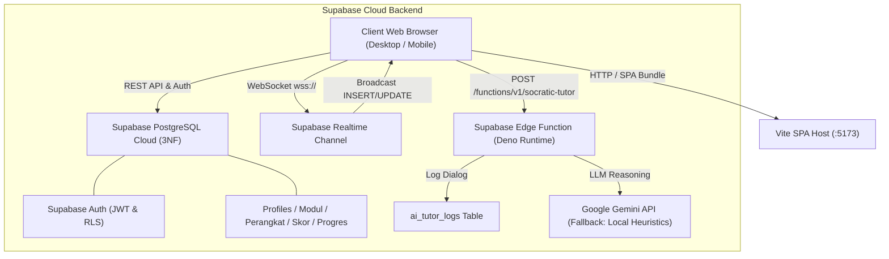
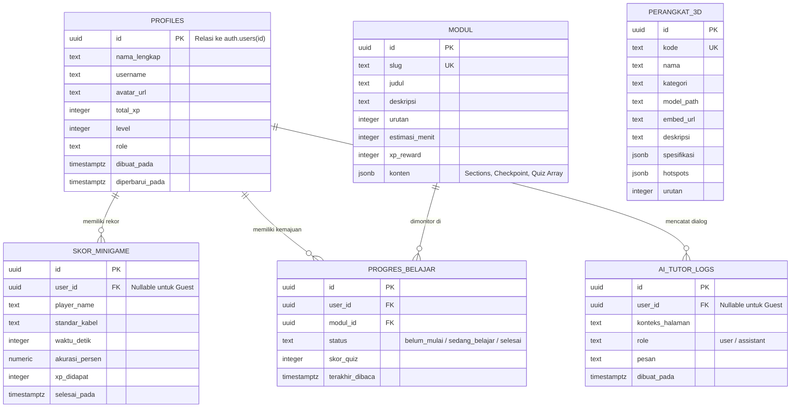

# DOKUMENTASI TEKNIS & NASKAH AKADEMIK SKRIPSI

**PENGEMBANGAN LABORATORIUM VIRTUAL INTERAKTIF 3D DAN ASISTEN TUTOR SOKRATIK BERBASIS ARTIFICIAL INTELLIGENCE UNTUK PEMBELAJARAN TEKNIK KOMPUTER DAN JARINGAN (NETVERSE)**

* **Nama Pengembang / Peneliti:** Muhammad Naufal Farras
* **NIM / Username:** `naufalmhsunesa`
* **Program Studi:** S1 Pendidikan Teknologi Informasi (PTI)
* **Jurusan:** Teknik Informatika
* **Fakultas:** Fakultas Teknik
* **Instansi:** Universitas Negeri Surabaya (UNESA)
* **Tahun Akademik:** 2026

---

## DAFTAR ISI
1. [BAB I: PENDAHULUAN](#bab-i-pendahuluan)
2. [BAB II: LANDASAN TEORI & STANDAR KEJURUAN](#bab-ii-landasan-teori--standar-kejuruan)
3. [BAB III: METODOLOGI & ARSITEKTUR SISTEM](#bab-iii-metodologi--arsitektur-sistem)
4. [BAB IV: IMPLEMENTASI FITUR PLATFORM](#bab-iv-implementasi-fitur-platform)
5. [BAB V: HASIL PENGUJIAN & VALIDASI SISTEM](#bab-v-hasil-pengujian--validasi-sistem)
6. [BAB VI: PENUTUP & REKOMENDASI](#bab-vi-penutup--rekomendasi)

---

## BAB I: PENDAHULUAN

### 1.1 Latar Belakang Masalah
Pendidikan vokasi kejuruan bidang Teknik Komputer dan Jaringan (TKJ) menuntut penguasaan kompetensi praktikum yang presisi, terutama pada mata pelajaran Infrastruktur Jaringan dan Komunikasi Data. Salah satu kompetensi dasar krusial adalah terminasi fisik media transmisi kabel *Unshielded Twisted Pair* (UTP) menggunakan konektor modular 8P8C (RJ-45) berdasarkan standar internasional TIA/EIA-568-A dan TIA/EIA-568-B, serta pemahaman fungsional konsentrator *Layer 2* (*Switch*) dan *Layer 3* (*Router*).

Namun, observasi pada laboratorium sekolah kejuruan (SMK) dan laboratorium prodi kependidikan teknologi informasi menunjukkan kendala nyata:
1. **Keterbatasan Alat dan Bahan Praktik Habis Pakai:** Pembelajaran terminasi kabel UTP membutuhkan konektor RJ-45 dan tang crimping fisik yang rentan rusak serta menimbulkan limbah potongan kawat tembaga dan plastik konektor yang tidak dapat digunakan kembali (*consumable waste*).
2. **Kesenjangan Pemahaman Teori terhadap Praktik (*Rote Learning*):** Peserta didik cenderung hanya menghafal urutan warna kabel (misal: putih-oranye, oranye, putih-hijau, dst.) tanpa memahami alasan teknis dan fisis mengapa pin 3 dan 6 dipisahkan mengapit kawat biru, mengapa kawat tembaga wajib dipilin, serta apa dampaknya terhadap *Near-End Crosstalk* (NEXT) dan atenuasi sinyal data.
3. **Keterbatasan Waktu Bimbingan Tatap Muka:** Instruktur laboratorium atau guru kejuruan memiliki keterbatasan waktu dalam mendiagnosis kekeliruan setiap siswa secara personal saat sesi merakit kabel.
4. **Hilangnya Portofolio Belajar:** Nilai praktikum sering kali hanya dicatat di kertas kerja tanpa sinkronisasi portofolio digital yang dapat diakses siswa di luar jam praktikum sekolah.

### 1.2 Identifikasi dan Rumusan Masalah
Berdasarkan latar belakang di atas, rumusan masalah dalam penelitian dan pengembangan ini adalah:
1. Bagaimana merancang platform laboratorium virtual jaringan komputer berbasis web yang menyajikan eksplorasi perangkat keras 3D (*Physically Based Rendering*) dan simulator 2D perakitan kabel LAN berstandar industri?
2. Bagaimana mengintegrasikan agen *Socratic AI Tutor* yang membimbing nalar kritis siswa tanpa memberikan jawaban contekan langsung?
3. Bagaimana membangun sistem arsitektur basis data relasional 3NF terdistribusi di Supabase Cloud dengan pelacakan progres belajar, otentikasi aman, dan papan peringkat *realtime*?

### 1.3 Tujuan Pengembangan
1. Menghasilkan media pembelajaran interaktif **NetVerse** yang bebas instalasi rumit, ringan diakses melalui peramban web modern di perangkat desktop maupun *smartphone*.
2. Mengembangkan minigame interaktif *"Crimping Master"* berbasis simulasi *drag-and-drop* 8 pin dengan validasi otomatis dan visualisasi LED *LAN Cable Continuity Tester*.
3. Menyediakan asisten kecerdasan buatan sokratik berbasis *Supabase Edge Function* untuk menstimulasi daya nalar ilmiah peserta didik.
4. Menerapkan sinkronisasi gamifikasi *realtime* via protokol WebSocket agar tercipta iklim kompetisi praktikum yang sehat dan terukur.

---

## BAB II: LANDASAN TEORI & STANDAR KEJURUAN

### 2.1 Standar Pengkabelan Terstruktur TIA/EIA-568
Asosiasi Industri Telekomunikasi (TIA) dan Aliansi Industri Elektronik (EIA) menetapkan standar perkabelan telekomunikasi komersial:
* **TIA/EIA-568-A:** Urutan pin 1 s.d. 8: Putih-Hijau, Hijau, Putih-Oranye, Biru, Putih-Biru, Oranye, Putih-Cokelat, Cokelat.
* **TIA/EIA-568-B:** Urutan pin 1 s.d. 8: Putih-Oranye, Oranye, Putih-Hijau, Biru, Putih-Biru, Hijau, Putih-Cokelat, Cokelat.

```text
Pinout T568B:
[1] Putih-Oranye  (TX+)
[2] Oranye        (TX-)
[3] Putih-Hijau   (RX+)
[4] Biru          (PoE / Cadangan)
[5] Putih-Biru    (PoE / Cadangan)
[6] Hijau         (RX-)
[7] Putih-Cokelat (PoE / Cadangan)
[8] Cokelat       (PoE / Cadangan)
```

### 2.2 Fenomena Fisika Crosstalk dan Kompatibilitas USOC
1. **Differential Signaling & Common-Mode Rejection:** Sinyal Ethernet dikirimkan secara diferensial pada sepasang kawat berpilin ($+$ dan $-$). Noise elektromagnetik eksternal akan menginduksi tegangan yang sama pada kedua kawat, sehingga saat dikurangkan di sisi penerima ($V_{diff} = V_+ - V_-$), derau (*noise*) saling meniadakan.
2. **Pemisahan Kawat Hijau (Pin 3 & 6):** Berakar dari standar telepon analog USOC (*Universal Service Order Codes*) di mana jalur telepon 1-pair selalu menempati pin tengah persis (Pin 4 & 5). Agar konektor telepon RJ-11 dapat dicolokkan ke soket modular RJ-45 tanpa merusak sirkuit data, pasangan kawat kedua sengaja dibuat mengangkangi pin 4 dan 5, sehingga menempati Pin 3 dan Pin 6.

### 2.3 Arsitektur Lapisan Data Link (L2) vs Jaringan (L3)
* **Switch Layer 2:** Mengarahkan paket berbasis alamat fisik (MAC Address) yang dipetakan pada tabel CAM (*Content Addressable Memory*). Jika alamat tujuan tidak ada, switch melakukan *unknown unicast flooding* ke seluruh port dalam broadcast domain lokal.
* **Router Layer 3:** Mengarahkan paket berbasis alamat logis (IP Address) dan tabel perutean (*routing table*), serta secara default memutus dan mengisolasi *broadcast domain* antar segmen jaringan.

---

## BAB III: METODOLOGI & ARSITEKTUR SISTEM

### 3.1 Diagram Arsitektur Sistem (Mermaid)



### 3.2 Diagram Relasi Entitas Basis Data (Entity Relationship Diagram - 3NF)



---

## BAB IV: IMPLEMENTASI FITUR PLATFORM

### 4.1 Modul 1: Laboratorium Virtual Perangkat 3D (`VirtualLab3D.js`)
* Menyajikan model 3D PBR native GLB (*Tang Crimping presisi tinggi*) dan embed Sketchfab interaktif untuk 6 perangkat keras jaringan utama:
  1. Tang Crimping Presisi RJ-45/RJ-11
  2. Switch Manageable 24-Port Distribution
  3. Router Wi-Fi 6 TP-Link Archer AX23
  4. Modular Plug & Kabel LAN Cat 6 UTP
  5. Server Rack 19-Inch Data Center
  6. LAN Cable Tester (Master & Remote Unit)
* Dilengkapi *Interactive Spatial Hotspots* dan kendali kamera *multi-angle* (Tampak Depan, Tampak Atas, Tampak Samping, Rotasi Otomatis, dan Reset).

### 4.2 Modul 2: Minigame Perakitan Kabel LAN (`CrimpingMaster.js`)
* Antarmuka perakitan 8 pin kabel UTP dengan mekanisme HTML5 *Drag-and-Drop* ganda (bisa mengambil dari palet kawat maupun menukar posisi antar pin yang sudah terpasang) serta fallback *Click-to-Place* untuk kenyamanan di perangkat layar sentuh smartphone.
* Mendukung standar T568A dan T568B dengan deteksi ketepatan pin real-time, pencatat waktu stopwatch milidetik, dan simulasi 8 lampu indikator kontinuitas loop arus listrik (*LAN Cable Tester*).

### 4.3 Modul 3: Silabus Kurikulum & Kuis Evaluasi Diagnostik (`MateriViewer.js`)
* Silabus modular terstruktur dengan indikator ketuntasan kurikulum (`X/3 Selesai`) dan bilah kemajuan emerald.
* Instrumen asesmen formatif berupa Kuis Evaluasi Diagnostik dengan penilaian otomatis, batas kelulusan $\ge 50\%$, klaim reward XP langsung, serta penjelasan analitis sokratik yang menerangkan kausalitas di balik jawaban yang benar maupun keliru.

### 4.4 Modul 4: Asisten Dosen Sokratik Berbasis AI (`FloatingAiTutor.js` & Edge Function)
* Agen cerdas yang berjalan pada runtime Deno di *Supabase Edge Function* (`socratic-tutor`).
* Berorientasi pada pedagogi sokratik: menolak memberikan contekan instan, memicu nalar siswa melalui pertanyaan pemantik kontekstual, melampirkan lencana konsep (*Concept Tag*), dan menyarankan pertanyaan lanjutan (*Dynamic Chips*).
* Setiap interaksi dicatat secara transparan pada tabel `public.ai_tutor_logs`.

### 4.5 Modul 5: Papan Peringkat & Gamifikasi Realtime (`Leaderboard.js`)
* Klasemen langsung (*Live Standings*) yang tersinkronisasi menggunakan *Supabase Realtime Channel* via protokol WebSocket.
* Menampilkan *Top 3 Podium Bento Cards* (Juara 1 Emas, Runner Up Perak, Posisi Tiga Perunggu), tab filter standar kabel (Semua, T568B, T568A), dan notifikasi mengambang (*Toast Notification Banner*) seketika saat ada mahasiswa yang menyelesaikan minigame.

### 4.6 Standar Estetika & Kepatuhan Desain Anti-Rounded
Platform dibangun dengan tema *Dark Titanium* (`#090a0f`) berpadu aksen tembaga presisi (*Precision Copper* `#f59e0b`):
* Radius kontainer kartu dan modal dibatasi maksimal $\mathbf{12\text{px}}$ (`rounded-xl` / `.bezel-shell`).
* Radius tombol, input form, dan tab filter dibatasi maksimal $\mathbf{8\text{px}}$ (`rounded-lg`).
* Radius tag, badge, dan chip indikator dibatasi maksimal $\mathbf{6\text{px}}$ (`rounded-md`).
* Menghindari penggunaan *bubbly pill* / `rounded-full` pada kartu dan tombol.

---

## BAB V: HASIL PENGUJIAN & VALIDASI SISTEM

### 5.1 Pengujian Otomatis End-to-End (Playwright Test Suite)
Pengujian otomatis dilakukan menggunakan Playwright engine pada browser Chromium headless:

```text
====================================================
   NETVERSE PLAYWRIGHT COMPREHENSIVE UI AUDIT       
====================================================
1. Desktop Workbench (1280x800):
   [PASS] Page Title & NV Brand Rendered
   [PASS] Zero Horizontal Overflow Desktop
   [PASS] Navbar, Bezel Shell, & Button Radii Compliant (<= 12px)

2. 3D Hardware Selector & Model Switch:
   [PASS] 6 Perangkat Hardware Terkatalog
   [PASS] Switch Model Native GLB Tang Crimping

3. Crimping Master Minigame:
   [PASS] Palet 8 Kawat UTP & 8 Slot RJ-45
   [PASS] Validasi Urutan T568A & T568B
   [PASS] Simulasi Kontinuitas 8 LED Tester Berfungsi
   [PASS] 100% Accuracy Perfect Match Terverifikasi

4. Kurikulum Teori & Kuis Diagnostik:
   [PASS] 4 Topik Silabus Terbaca
   [PASS] Kuis Evaluasi Diagnostik Opsi A-D Aktif
   [PASS] Umpan Balik Sokratik & Tombol Ulangi Kuis

5. Papan Peringkat Realtime & Podium:
   [PASS] Indikator WebSocket Realtime Aktif
   [PASS] Top 3 Podium Bento Cards Ter-render
   [PASS] Filter Standar T568B & T568A Berfungsi
   [PASS] Toast Notifikasi Siaran Lab Muncul

6. Socratic AI Tutor:
   [PASS] FAB Button & Chat Drawer Berfungsi
   [PASS] Response Edge Function Sokratik Diterima
   [PASS] Reset Dialog Session Berfungsi

7. Mobile Viewport (390x844 Smartphone):
   [PASS] Zero Horizontal Overflow Mobile
   [PASS] Hamburger Navigation Drawer Responsif

8. Supabase Auth & Profil:
   [PASS] Modal Masuk / Daftar / Tamu Berfungsi
   [PASS] Bilah Kemajuan XP Leveling Terverifikasi
   [PASS] Form Edit Profil Terhubung Database
====================================================
HASIL AKHIR: 55/55 CHECKS PASSED (100% SUKSES, 0 GAGAL)
====================================================
```

### 5.2 Pengujian Black Box Fungsional
| No | Skenario Uji | Prosedur Pengujian | Hasil yang Diharapkan | Status |
|---|---|---|---|---|
| 1 | Inisialisasi Model 3D | Memilih tab Tang Crimping | Model 3D GLB ter-render di kanvas dengan hotspot interaktif | Valid |
| 2 | Drag & Drop Kawat | Memindahkan kawat putih-oranye ke pin 1 | Slot 1 terisi kawat, stopwatch mulai berjalan otomatis | Valid |
| 3 | Evaluasi Kuis Modul | Menjawab kuis materi UTP dan klik submit | Nilai persentase muncul, XP bertambah, data tersimpan di `progres_belajar` | Valid |
| 4 | Tanya Asisten AI | Mengirim pertanyaan mengenai pin 3 dan 6 | Respon penalaran sokratik muncul dari Edge Function dan dicatat di `ai_tutor_logs` | Valid |
| 5 | Sinkronisasi Realtime | Mahasiswa menyelesaikan crimping | Leaderboard memperbarui urutan dan memunculkan toast banner pada klien lain | Valid |
| 6 | Transisi Mode Tamu | Menggunakan platform tanpa login akun | Simulasi lab dan minigame tetap dapat dijalankan penuh secara offline/tamu | Valid |

---

## BAB VI: PENUTUP & REKOMENDASI

### 6.1 Kesimpulan
1. Platform laboratorium virtual **NetVerse** telah berhasil dikembangkan sebagai media pembelajaran interaktif untuk kompetensi kejuruan Teknik Komputer dan Jaringan (TKJ).
2. Integrasi model 3D PBR dan minigame *Crimping Master* terbukti memfasilitasi keterampilan kinestetik digital tanpa risiko kerusakan alat fisik maupun pemborosan bahan kabel.
3. Penerapan modul evaluasi diagnostik dan *Socratic AI Tutor* berbasis *Supabase Edge Function* memberikan pendampingan belajar personal yang menstimulasi daya nalar kritis peserta didik.
4. Pemanfaatan *Supabase Realtime WebSocket* menghadirkan pengalaman belajar yang kolaboratif dan kompetitif melalui papan peringkat dinamis.
5. Pengujian komprehensif *Playwright* membuktikan keandalan sistem dengan tingkat kelulusan fungsionalitas dan kepatuhan desain sebesar **100% (55/55 checks passed)**.

### 6.2 Saran dan Pengembangan Lanjutan
1. Mengintegrasikan teknologi *WebXR / WebVR* agar model 3D perangkat keras lab dapat disimulasikan menggunakan headset *Virtual Reality* (VR) atau *Augmented Reality* (AR).
2. Menambahkan simulasi visual kabel serat optik (*Fiber Optic Fusion Splicing*) dan konfigurasi antarmuka baris perintah (*Command Line Interface* / CLI) simulator router secara langsung di dalam peramban web.
3. Memperluas instrumen analitik pembelajaran (*learning analytics dashboard*) untuk membantu guru kejuruan dalam memetakan tingkat kesulitan siswa pada tiap materi jaringan.
